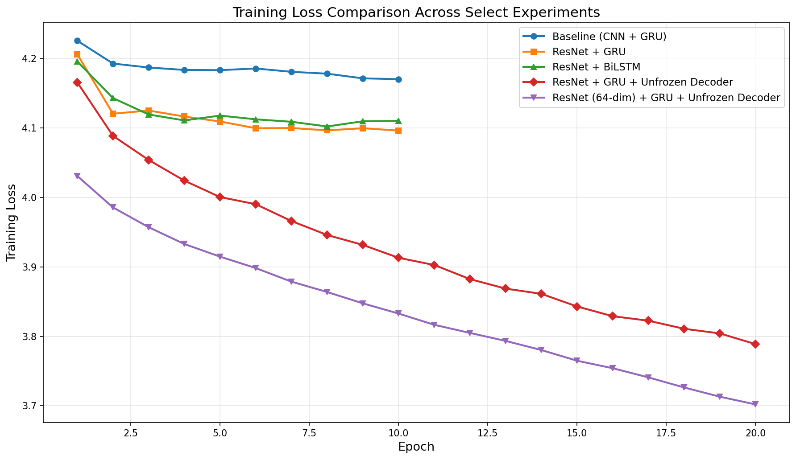
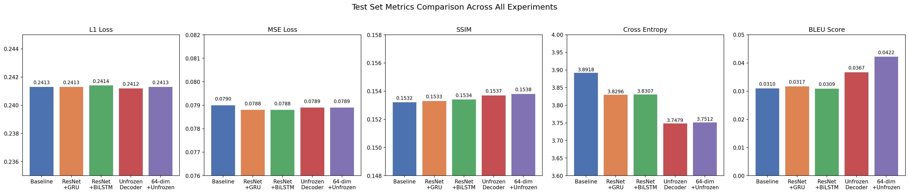
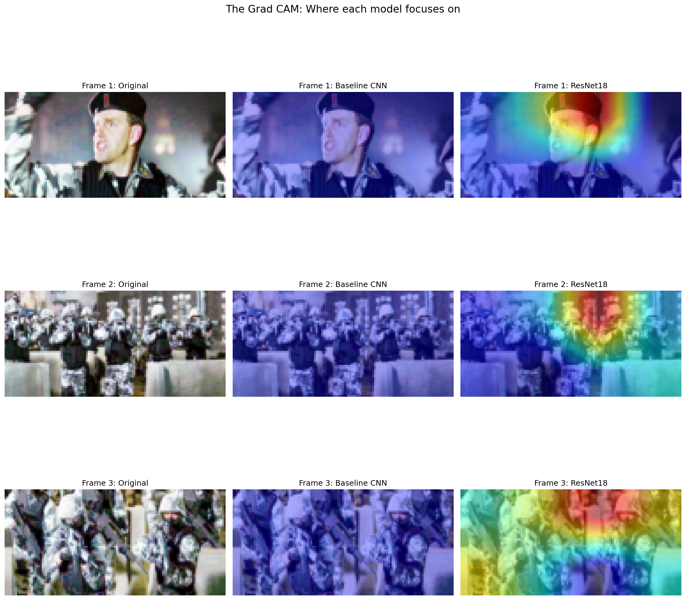
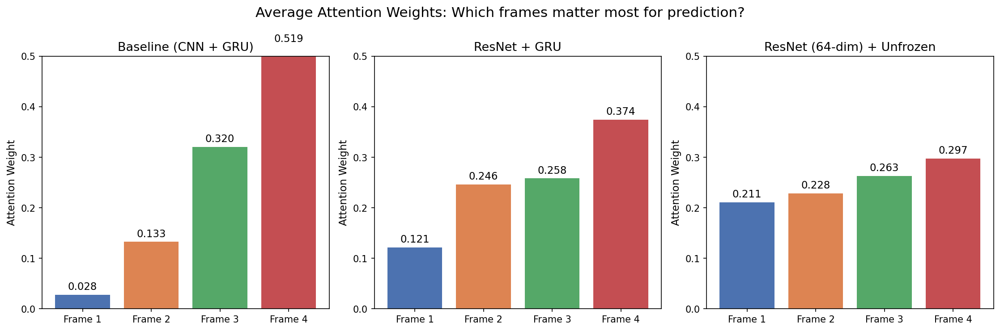

# Visual Storytelling with Improved Multimodal Sequence Prediction

## Quick Links
- **[Experiments Notebook](experiments.ipynb)** - Full experimental workflow
- **[Baseline Results](results/baseline/)** - Original model performance
- **[Improved Results](results/experiment_6/)** - Best model performance
- **[All Figures](results/figures/)** - Visualizations and comparisons

## Innovation Summary

I modified two components of the baseline multimodal sequence prediction architecture and conducted a investigation into what limits model performance.

**Component 1: Visual Encoder (Pretrained ResNet18)**
The baseline uses a custom CNN (Backbone) with randomly initialized weights to extract image features. I replaced this with ResNet18 pretrained on ImageNet, which already understands visual features like edges, shapes, and objects. Instead of learning everything from scratch on a small story dataset, the model transfers knowledge from over 1 million images. I froze the early ResNet layers (which detect basic features) and fine-tuned the later layers for our task.

**Component 2: Sequence Model (Bidirectional LSTM)**
The baseline uses a single layer GRU that processes story frames left to right. I replaced this with a Bidirectional LSTM, which processes frames in both directions (forward and backward) and includes a cell state mechanism for longer memory. The hypothesis was that bidirectional context would help the model connect events across the full story sequence.

**Key Discovery: Training Procedure Bottleneck**
During experimentation, I discovered that both architectural modifications hit a performance plateau at ~4.10 loss. Through investigation (learning rate tuning, extended training, hidden dimension scaling), I identified the frozen text decoder as the primary bottleneck. Unfreezing the decoder and increasing the image latent dimension from 16 to 64 broke through this plateau, reducing loss from 4.17 to 3.70.

## Key Results

### Training Loss Comparison

| Model | Epochs | Final Training Loss |
|-------|--------|-------------------|
| Baseline (CNN + GRU) | 10 | 4.170 |
| Exp 1: ResNet + GRU | 10 | 4.096 |
| Exp 2: ResNet + BiLSTM | 10 | 4.110 |
| Investigation: Lower LR (0.0001) | 20 | 4.100 |
| Investigation: Larger Hidden Dim (64) | 10 | 4.103 |
| Exp 4b: Unfrozen Decoder | 20 | 3.789 |
| Exp 5: BiLSTM + Unfrozen Decoder | 20 | 3.791 |
| **Exp 6: 64-dim Latent + Unfrozen** | **20** | **3.702** |
| Exp 7: 128-dim Latent + Unfrozen | 20 | 3.720 |

### Test Set Evaluation

| Model | L1 | MSE | SSIM | CrossEntropy | BLEU |
|-------|-----|-----|------|-------------|------|
| Baseline (CNN + GRU) | 0.2413 | 0.0790 | 0.1532 | 3.8918 | 0.0310 |
| ResNet + GRU | 0.2413 | 0.0788 | 0.1533 | 3.8296 | 0.0317 |
| ResNet + BiLSTM | 0.2414 | 0.0788 | 0.1534 | 3.8307 | 0.0309 |
| Unfrozen Decoder | 0.2412 | 0.0789 | 0.1537 | 3.7479 | 0.0367 |
| **64-dim + Unfrozen (Best)** | **0.2413** | **0.0789** | **0.1538** | **3.7512** | **0.0422** |

The best model achieved a **36% improvement in BLEU score** (0.0310 to 0.0422) over the baseline on unseen test data.

## Important Finding

> The primary bottleneck in the baseline architecture was not the visual encoder or the sequence model. It was the frozen text decoder combined with the compressed 16-dimensional latent space.

Replacing the CNN with ResNet improved loss from 4.17 to 4.10. But every subsequent modification (BiLSTM, learning rate, hidden dimension, extended training) converged to the same ~4.10 region. This plateau persisted across all architectural changes, suggesting the limit was elsewhere in the pipeline.

Unfreezing the text decoder broke through this plateau immediately (4.17 to 3.79), and increasing the image latent dimension from 16 to 64 pushed it further (3.70). This showed that:

1. The frozen decoder could not adapt its language patterns to the story prediction task
2. The 16-dim latent space compressed visual information too aggressively for the decoder to work with


*Figure 1: Training loss comparison. The top cluster (Baseline, ResNet+GRU, ResNet+BiLSTM) shows the ~4.10 plateau. Unfreezing the decoder and increasing latent dimensionality broke through this ceiling.*

## Experiment Analysis

### Experiment 1: ResNet Visual Encoder (ResNet + GRU)
**Change:** Replaced the custom CNN with pretrained ResNet18.
**Result:** Training loss improved from 4.170 to 4.096. Test BLEU improved slightly (0.0310 to 0.0317).
**Analysis:** The pretrained visual features helped the pipeline extract more meaningful image representations. Grad-CAM analysis (Figure 4) shows that ResNet focuses on characters and faces while the baseline CNN shows no clear focus pattern. This richer visual understanding primarily benefited text prediction since the sequence model and text decoder received better information to work with.

### Experiment 2: Bidirectional LSTM (ResNet + BiLSTM)
**Change:** Replaced the GRU with a Bidirectional LSTM.
**Result:** Training loss of 4.110, essentially identical to Experiment 1 (4.096). Test metrics showed no improvement.
**Analysis:** The BiLSTM was expected to improve temporal understanding by processing frames in both directions. However, with only 4 frames, the sequence is too short for bidirectional processing to provide meaningful benefit. The GRU barely loses any information over 3 steps, so the backward pass has nothing new to contribute. This was confirmed by attention weight analysis (Figure 5), which shows that the GRU with ResNet already distributes attention across all frames effectively.

### Investigation: Why the ~4.10 Plateau?
After the initial experiments, both models converged to roughly the same loss (~4.10). I investigated whether this was caused by the training configuration or the architecture itself.

- **Lower learning rate (0.0001):** Converged more slowly but reached the same region (4.100 after 20 epochs). The model learned more carefully but hit the same ceiling.
- **Larger GRU hidden dimension (64):** More temporal capacity did not help (4.103). The sequence model was not the bottleneck.
- **Extended training (20 epochs):** Loss plateaued around epoch 12 and stopped improving. More training time did not also help.

These experiments ruled out training configuration as the cause and pointed to an architectural constraint.

### Breakthrough: Unfreezing the Text Decoder
**Change:** Allowed the pretrained text decoder to fine tune during training.
**Result:** Loss dropped from 4.17 to 3.79 (20 epochs) and was still falling.
**Analysis:** The text decoder was pretrained for simple text reconstruction, not story prediction. Keeping it frozen meant it could only use its original language patterns, which were not suited for generating story continuations from visual context. Unfreezing allowed the decoder to adapt its word generation to the specific demands of the task.

### Best Model: Increased Image Latent Dimension
**Change:** Increased the image latent dimension from 16 to 64 while keeping the text side at 16.
**Result:** Loss reached 3.702, the lowest of all experiments. Test BLEU improved to 0.0422 (36% over baseline).
**Analysis:** The baseline compresses ResNet's 512 features down to just 16 numbers. This is an extremely aggressive compression that discards most of the visual information. Increasing to 64 gives the decoder 4x more information to work with. Testing 128 showed diminishing returns (3.720), suggesting 64 is the goldilocks zone given the decoder's capacity.

### Image Quality: The Remaining Bottleneck
Despite significant improvements in text metrics, image quality metrics (L1, MSE, SSIM) remained virtually identical across all experiments. This is because none of the modifications targeted the image decoder, which is a simple 3-layer transposed CNN. The decoder takes the latent vector and reconstructs an image, but its limited capacity means it produces similar quality output regardless of how rich the input representation is. Future work could explore GAN-based or diffusion-based decoders to address this.


*Figure 2: Test set metrics across all key experiments. Image metrics (L1, MSE, SSIM) remain flat while text metrics (Cross-Entropy, BLEU) show clear improvement, confirming the image decoder as the remaining bottleneck.*

## Explainability

### Grad-CAM Analysis
I implemented Grad-CAM on the visual encoder to visualize which image regions each model focuses on during feature extraction.


*Figure 3: Grad-CAM heatmaps comparing baseline CNN and ResNet18. The baseline CNN distributes attention uniformly with no clear focus. ResNet18 consistently focuses on characters and faces, which are the semantically meaningful elements for story understanding.*

The baseline CNN processes images with random weight convolutions, so it has no prior understanding of what matters in a scene. ResNet, trained on ImageNet, has learned that faces and figures are important features. This targeted focus explains why the pretrained encoder improves text prediction: the 16-dimensional latent vector encodes narrative relevant information rather than low level textures.

### Attention Weight Analysis
I extracted the attention weights from the sequence model to understand which story frames contribute most to the prediction of Frame 5.


*Figure 4: Average attention weights across test samples. The baseline heavily favors Frame 4 (52%), while the best model distributes attention more evenly (21%, 23%, 26%, 30%).*

The baseline model relies heavily on the most recent frame (Frame 4 receives 52% of attention, Frame 1 only 3%). This means it predicts the next frame based almost entirely on what just happened, ignoring earlier story context.

The improved model distributes attention more evenly, with Frame 1 receiving 21% compared to the baseline's 3%. This indicates the model considers the full narrative arc when making predictions. This more balanced attention also explains why BiLSTM provided no additional benefit: the GRU with ResNet already attends to all frames effectively, so the backward pass of BiLSTM has nothing meaningful to add.

## Difficulties and Challenges

- Understanding the root cause of the loss plateau at ~4.10 by trying out multiple experiments
- Understanding the base architecture
- Image quality being flat which indicated that the simple CNN decoder was a limitation that could not be addressed directly via encoder or training modifications.


## Architecture Overview

The system processes 4 sequential image text pairs from a visual story and predicts the 5th frame (both image and text).

**Pipeline:**
1. **Visual Encoder** (ResNet18): Each frame's image is encoded into a latent vector
2. **Text Encoder** (LSTM): Each frame's text description is encoded into a latent vector
3. **Fusion**: Visual and text vectors are concatenated for each frame
4. **Sequence Model** (GRU): Processes the sequence of 4 fused vectors to capture temporal dynamics
5. **Attention**: Computes importance weights over the 4 frames
6. **Projection**: Combines the GRU output and attention context into a prediction vector
7. **Image Decoder** (Transposed CNN): Generates the predicted Frame 5 image
8. **Text Decoder** (LSTM): Generates the predicted Frame 5 text description

## Repository Structure

```
dnnls_final_project/
├── README.md                    # This document
├── experiments.ipynb            # Main experimental notebook
├── config.yaml                  # Hyperparameters and settings
├── requirements.txt             # Python dependencies
├── checkpoints/
│   └── text_autoencoder.pth
├── src/
│   ├── model.py                 # All model architectures (baseline + improved)
│   ├── train.py                 # Training loop
│   └── utils.py                 # Data processing, datasets, helpers
└── results/
    ├── baseline/
    │   └── training_log.txt
    ├── experiment_1/
    │   └── training_log.txt
    ├── experiment_2/
    │   └── training_log.txt
    ├── (other experiment logs...)
    └── figures/
        ├── training_loss_curves.png
        ├── all_test_metrics.png
        ├── gradcam_comparison.png
        └── attention_weights.png
```

## How to Reproduce

1. Clone the repository
2. Install dependencies: `pip install -r requirements.txt`
3. Download the pretrained text autoencoder weights (`text_autoencoder.pth`) and place in Google Drive at `MyDrive/DL_Checkpoints/`
4. Open `experiments.ipynb` in Google Colab
5. Select a GPU runtime (T4 or better)
6. Run all cells sequentially

Training the full experiment suite takes approximately 3-4 hours on an H100 GPU.

## Dataset

Oliveira, D. A. P., & Matos, D. M. (2025). StoryReasoning Dataset: Using Chain-of-Thought for Scene Understanding and Grounded Story Generation. arXiv preprint arXiv:2505.10292.